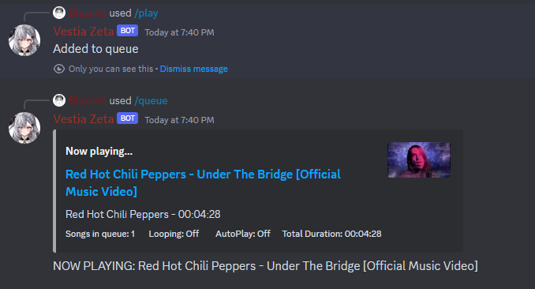
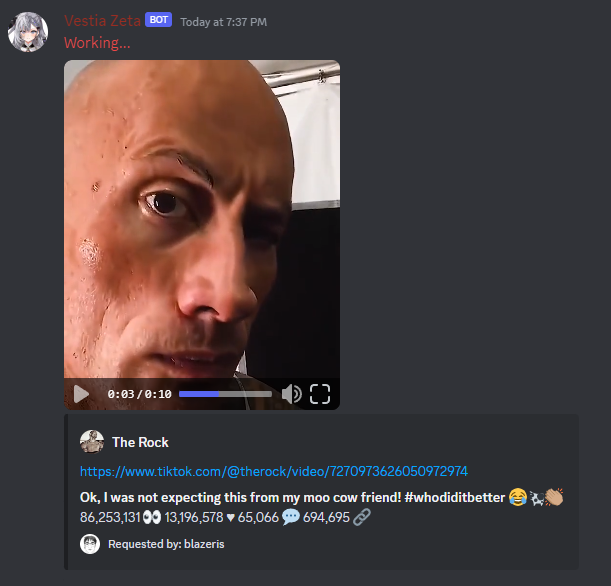
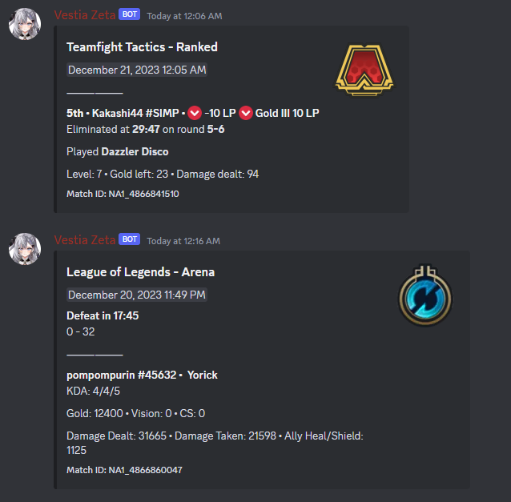
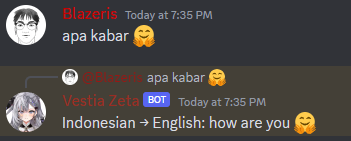

# discord-bot
Discord bot created using the Discord.js API with data hosted on Oracle Autonomous Database.

    
Built with five modules: Distube, TikTok, Riot Games, Birthday, and Holiday, Translate 

Distube module utilizes Distube.js to play YouTube videos as well as playing user customized outro songs  

TikTok module consumes TikWM web API to download stream TikTok videos then upload to Discord as a file 
 

Riot Games module consumes Riot web API to acquire recently played matches in League of Legends and Teamfight Tactics at regular intervals to track user detailed match history and ranked progression.  

Translate listens for messages and replies with an English translation if the language isn't English using DeepL API.

Birthday uses the database to keep track of birthdays and checking at time intervals to send a message the second it hits the day in local time zone  

Holiday is a collection various event listeners, commands, and activities to celebrate each holiday.  

